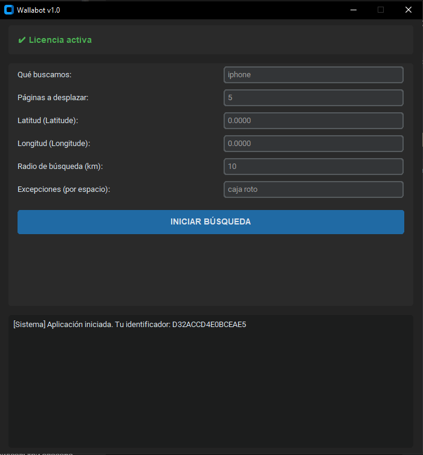

# 🚀 Wallabot v1.0 — Escáner de Chollos para Wallapop

**Wallabot** es una herramienta de escritorio diseñada para automatizar la búsqueda de productos y oportunidades de reventa (*resell*) en Wallapop en tiempo real.

---

## ✨ Características Principales

* ⚡ **Escaneo en Tiempo Real:** Detecta publicaciones recientes antes de que aparezcan en las búsquedas comunes.
* 🎯 **Filtros Avanzados:** Filtra por palabras clave, rango de páginas, ubicación (latitud/longitud) y radio en kilómetros.
* 🚫 **Exclusiones Personalizadas:** Omite productos no deseados (ej. *"caja de iPhone"*, *"roto"*, *"para piezas"*).
* 🛡️ **Seguridad e Identificador Único:** Sistema de licencias vinculado al Hardware ID (HWID) para garantizar la seguridad del software.

---

## 📥 ¿Cómo instalar y activar?

1. **Descarga la aplicación:** Descarga el archivo ejecutable `.exe` desde la sección de descargas.
2. **Obtén tu Identificador:** Abre la aplicación en tu equipo. En la consola inferior verás tu código único:
   `[Sistema] Aplicación iniciada. Tu identificador: XXXXXXXXXXXX`
3. **Activa tu Licencia:** Envía tu identificador por Telegram a [@vingsyx](https://t.me/vingsyx) para activar tu acceso.

---

## 📩 Contacto y Soporte

Si tienes dudas, quieres solicitar un periodo de prueba o adquirir una licencia, contáctanos en Telegram: [@vingsyx](https://t.me/vingsyx).
